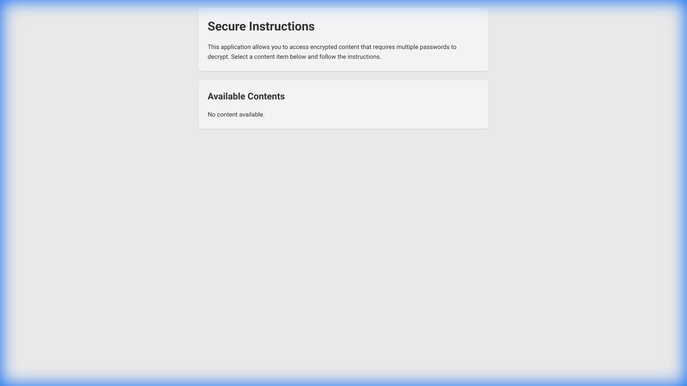
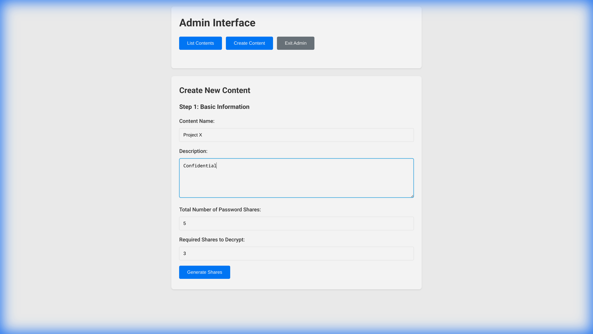
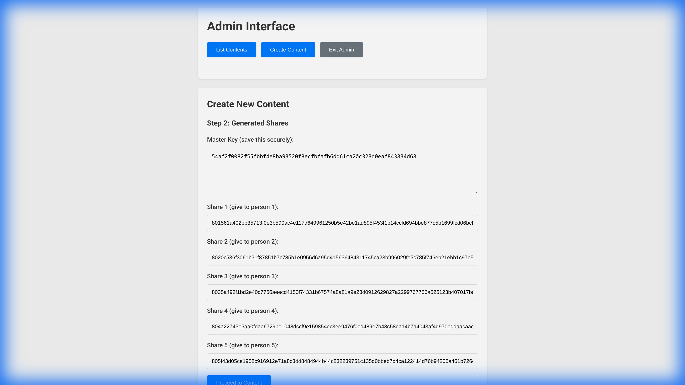
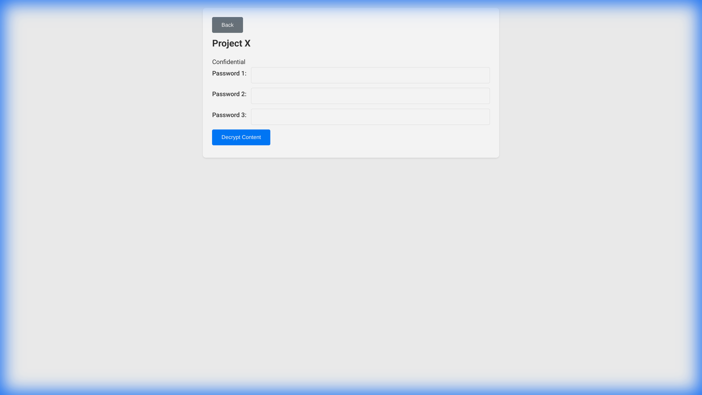

# Secure Instructions

A self-contained, offline-capable application for creating and distributing encrypted instructions and files. Access requires a consensus of multiple parties, using Shamir's Secret Sharing.

## Overview

This tool allows you to create sensitive content (text instructions and file attachments) that is encrypted using a master key. The master key is then split into multiple "shares" (passwords). To decrypt the content, a specified number of these shares must be combined.

**Key Features:**

*   **Offline First:** The generated HTML file works entirely offline. No data is sent to any server.
*   **Self-Contained:** The application, logic, and encrypted data are all contained within a single HTML file.
*   **Multi-Party Authorization:** Utilize Shamir's Secret Sharing to require multiple people to agree (by providing their password share) before the content can be viewed.
*   **Secure:** Uses AES-GCM encryption for content and Shamir's Secret Sharing for key management.
*   **File Support:** Attach files which are also encrypted and embedded directly into the HTML.

## Manual

This application is designed to be easy to use. The following guide walks you through creating and accessing secured content.

### 1. Creating Content (Admin)

To create new content, open `secure-instructions.html` in your browser. Navigating to the admin interface (usually by appending `#admin` to the URL or using a provided link) allows you to manage content.

Click "Create Content" to begin.

1.  **Enter Details:** Provide a name and description for your content.
2.  **Define Security:** Set the "Total Number of Password Shares" and the "Required Shares to Decrypt". For example, you can generate 5 shares but require only 3 to decrypt.

3.  **Generate Shares:** Click "Generate Shares". The system will create the requested number of password shares.
    *   **IMPORTANT:** Distribute these shares to the intended recipients immediately. The system does not store them for you.
    *   **Master Key:** A master key is also provided for emergency recovery if needed.

4.  **Add Content:** Enter the secret instruction text and upload any files you wish to secure.
5.  **Save:** Click "Save Content" to encrypt and embed the data into the application.

### 2. Distributing the Application

Once content is saved, the `secure-instructions.html` file now contains the encrypted data. You can distribute this single file to all parties (e.g., via email, USB drive, or shared network location).

**Note:** Ensure you have distributed the password shares securely to the respective key holders.

### 3. Accessing Content

To view the content, users open the `secure-instructions.html` file. They will see the list of available encrypted items.

1.  **Select Content:** Click "Access Content" for the item you wish to view.
2.  **Enter Shares:** The system will prompt for the required number of password shares.

3.  **Decrypt:** Once the valid shares are entered, click "Decrypt Content". The instructions and files will be revealed.

## License and Credits

This project is licensed under the MIT License.

This application includes the **secrets.js** library by **amper5and** (Alexander Stetsyuk) and others, which implements Shamir's Secret Sharing.

**secrets.js** is licensed under the MIT License:

> Copyright (c) 2014 Alexander Stetsyuk
>
> Permission is hereby granted, free of charge, to any person obtaining a copy
> of this software and associated documentation files (the "Software"), to deal
> in the Software without restriction, including without limitation the rights
> to use, copy, modify, merge, publish, distribute, sublicense, and/or sell
> copies of the Software, and to permit persons to whom the Software is
> furnished to do so, subject to the following conditions:
>
> The above copyright notice and this permission notice shall be included in all
> copies or substantial portions of the Software.
>
> THE SOFTWARE IS PROVIDED "AS IS", WITHOUT WARRANTY OF ANY KIND, EXPRESS OR
> IMPLIED, INCLUDING BUT NOT LIMITED TO THE WARRANTIES OF MERCHANTABILITY,
> FITNESS FOR A PARTICULAR PURPOSE AND NONINFRINGEMENT. IN NO EVENT SHALL THE
> AUTHORS OR COPYRIGHT HOLDERS BE LIABLE FOR ANY CLAIM, DAMAGES OR OTHER
> LIABILITY, WHETHER IN AN ACTION OF CONTRACT, TORT OR OTHERWISE, ARISING FROM,
> OUT OF OR IN CONNECTION WITH THE SOFTWARE OR THE USE OR OTHER DEALINGS IN THE
> SOFTWARE.
